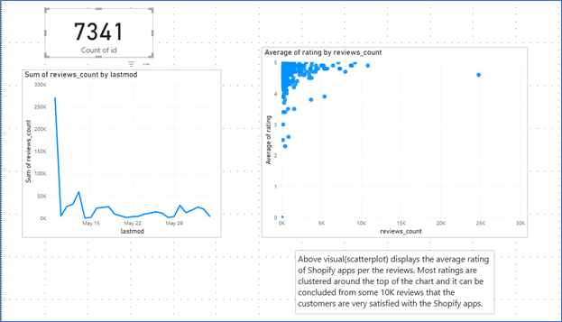
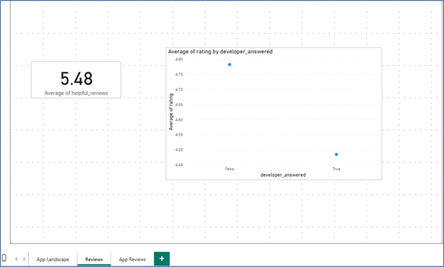
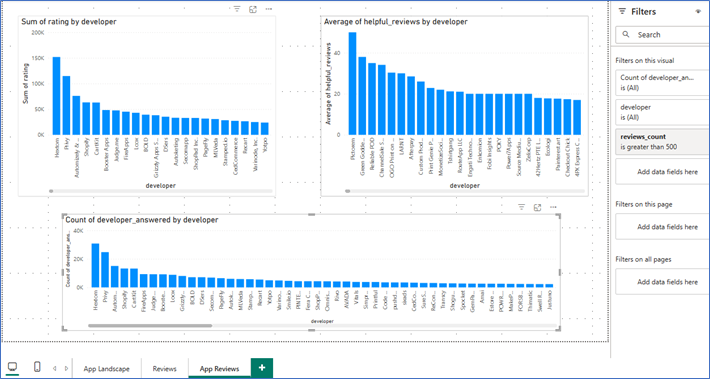

# Shopify App Analysis: Power BI project

## Overview
To review the landscape of apps on the Shopify platform, using data scraped from publicly available Shopify websites and to figure out what key factors play into the success of a Shopify app.

### The Data
* The shopify.xlsx dataset contains public data scraped from the Shopify App Store. It includes 4 tables:

* apps: Details of the apps on Shopify apps marketplace
* apps_categories: Join tables to connect apps with categories
* categories: Categories of the apps. Each app has multiple categories
* reviews: Each review (row) contains information on user opinion about the related app (rating and comment). Also, it contains the response from the developer if present.

The data is provided by TripleTen.

### Technologies 
* This analysis was conducted with tools: Power BI, DAX, Data Modeling

### Analysis
Analysis was conducted by studying three different areas :
* App Landscape: This was determined by:
	1. The Key Performance Indicator(KPI) as the number of Apps(unique app ids). 
	2. Built a line-graph with the total review counts on the last modified date.
	3. Built a scatter plot comparing average rating and review counts.

* Reviews: 
	1. Implemented DAX expression and created the helpful_reviews(rating multiplied by 1+helpful_count) column. This was to weigh the reviews, to find how helpful they were. Creatd the KPI card 	   with the average of the helpful_reviews column.
	2. Implemented another DAX expression to create the developer_answered column. The calculation was 1 (or TRUE) if the developer_reply column is not blank and 0 (or FALSE)) if the column row 	   is blank.
	3. Built a scatterplot comparing the average rating and developer_answered. 

* App Reviews:
	1. In the Data Model, created a new relationship between the Reviews table and the Apps table, by connecting app_id column from the Reviews table to the id column from the Apps table(many-		to-one relationship). Made a bar chart with the developer and the sum of ratings to determine total ratings for each developer.
	2. Built another bar chart comparing developer against the average of helpful_review. This was a better approach to determine high performing developer.
	3. Determine developer responsiveness: Built a bar chart between the developer and the developer_answered columns, added a Filter for this visual which selects only the rows where 		reviews_count is greater than 500.

 
### Visuals

### Conclusions:
* Landscape visuals: Most ratings are clustered around the top of the chart and it can be concluded from some 10K reviews that the customers are very satisfied with the Shopify apps.
* Reviews visuals: Developers responded when the average of the ratings was around 4.48(below 4.5). Developers did not respond when the average of ratings was around 4.78(close to 4.8). The developers did respond for lower ratings. This approach does help with addressing the customer grievances at a technical level and will help improve performace of the app eventually leading to the increase in ratings.
* App Reviews visuals: High performing developers are not generally the most responsive. Developers with the most rating count(sum) are the most responsive. 

### Power BI Report
* Available under the Project/Power BI Report directory.
