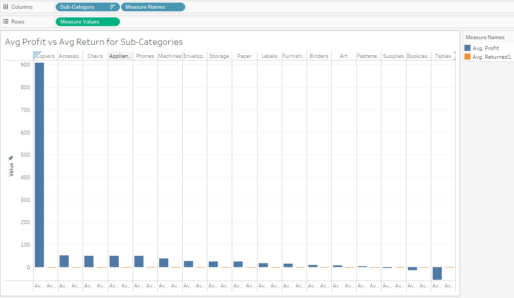

# Superstore_Sale_Analysis
### Overview
To review Superstore’s operations by identifying it's important profit and loss centers, by reviewing the return rates and check if the profitability increases through advertising.

### The Data
Dataset is "Superstore.xlsx,", a comprehensive collection of sales and customer-related information from a retail superstore retrieved from Kaggle. The data is provided by TripleTen.

### Rubric
Outlines the criteria and standards that is used to grade this project.

### Technologies 
* This analysis was conducted with tools: Tableau

### Analysis
* Profit and Loss Centers:
	1. Identified superstore's profit and loss centers from the pairs of dimensions(subcategory + region). 
	2. Identified it's two biggest profit and loss centers to decide which products the superstore should stop selling.
	3. Which product subcategories should the store focus on and which should they stop selling.

* Advertising: 
	1. Determined if advertising would help. Advertising works over time and geography and so identified the 3 best combinations of states and month of the year to advertise in.

* ROAS:
	1. Calculated the ROAS(return on ad spent) ratio, to determine if the store can spend on Ads for the top three states. The ROAS was calculated as 1/5 of profits.

* Avg Profit vs Avg Return for Sub-Categories 
	1. Identified if some products have abnormal rates of return to the store by finding products/sub-categories with highest return rate and customers with highest return rate.

 
### Visuals
Superstore Sale Analysis Tableau workbook which consits of below worksheets:

### Conclusions:
* Profit/Loss per Sub-category + Region visual: 
	1. The two biggest profit centers are West and East and biggest loss makers are Central and South. 
	2. 2 big profit makers: Copiers and Phones are highly popular sub-categories in 3 out of 4 regions. Store should focus on selling these top 3 sub-categories: Copiers, Phones and Accessories 
	3. 2 big loss- markers. Tables and bookcases are highly unpopular in 3 out of 4 regions. Store should stop selling these bottom 3 sub-categories: Tables, Bookcases and Supplies 
       
* Advertising(Avg Profit per State + Month)
	1. Rhode Island, Missouri and Indiana have the best sales for the months of September, October and December. 

* ROAS: 
	1. Store should be willing to pay for advertisements based on the ROAS(1/5 of profits) ratio.

* Returns:
	1. Store should keep doing business with Copiers, Accessories, Chairs ets. Store can do away with  the sub-categories of Tables, Bookcases and supplies

### Visualtizations: Dashboard Tableau Public
https://public.tableau.com/app/profile/tripty.sebastian/viz/SuperstoreSaleAnalysisRvw/SuperstoreSaleAnalysis
