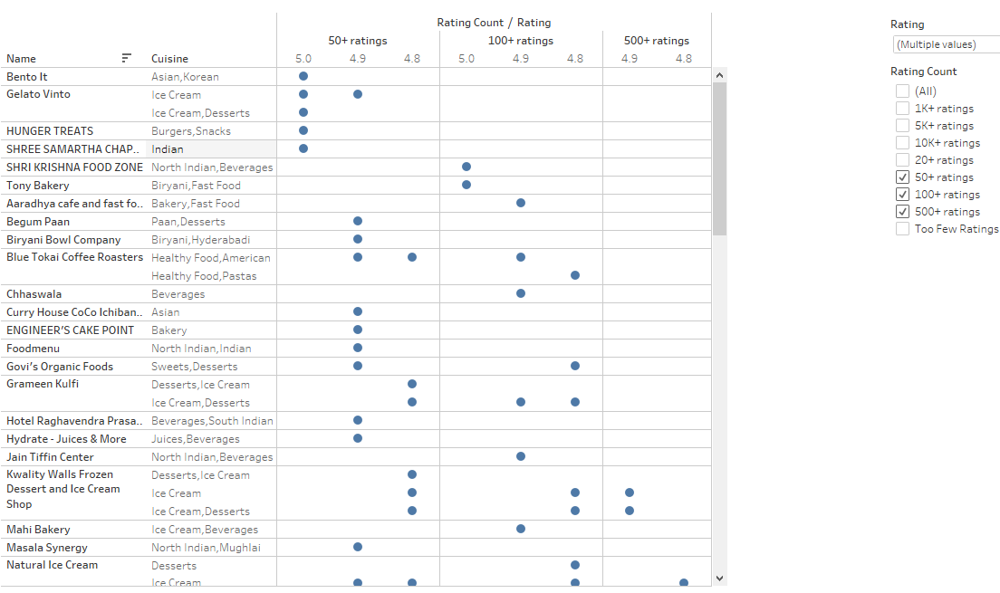
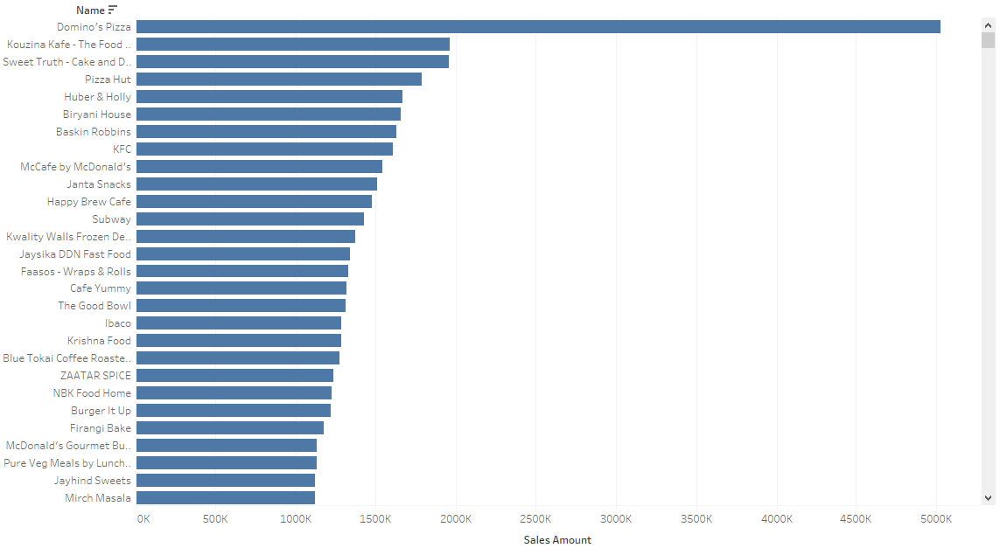
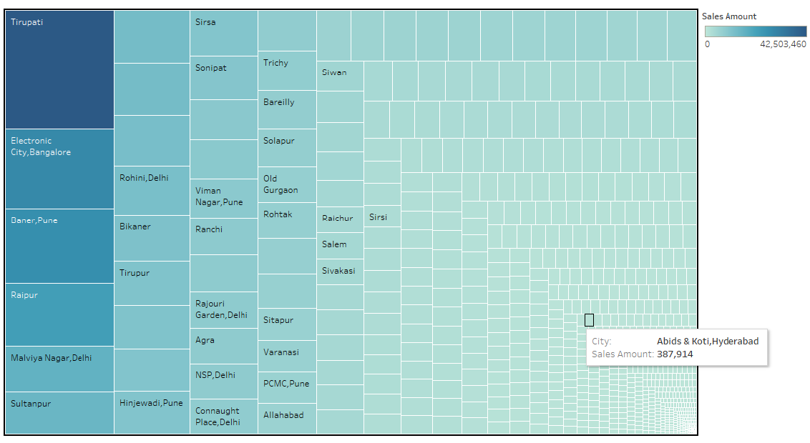
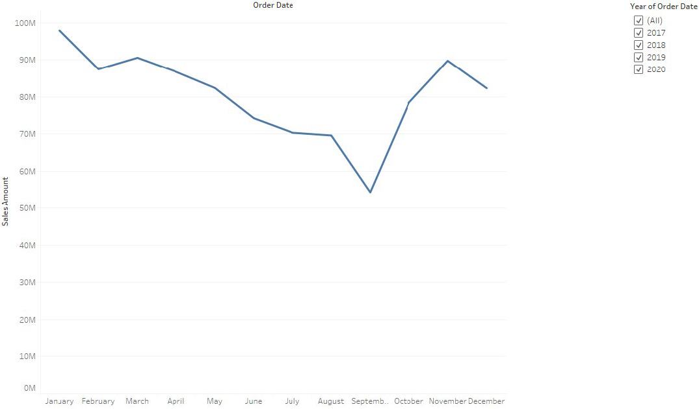

# RESTAURANT ANALYSIS FOR ZOMATO

## Overview
* Zomato is a multinational restaurant aggregator and a food delivery company. The assignment was to analyze the business performance of restaurants under Zomato. My analysis was to determine Zomato’s most popular restaurants and its highest revenue generating businesses (not necessarily the same) and to provide recommendations for the performance improvement of underperforming restaurants.

### The Data
* The data was spread across five files: food.csv, menu.csv, orders.csv, restaurant.csv and users.csv spanning over years 2017 – 2020. For analysis purposes, I have used the orders and restaurant csvs.

orders.csv: each row corresponds to a unique order placed by a customer
* 'order_date': date of the order
* 'sales_qty': quantity that was sold
* 'sales_amount': the amount of the sales
* 'currency': currency used
* 'user_id': unique identifier of each customer
* 'r_id': unique identifier of each restaurant

restaurants.csv: each row corresponds to a unique restaurant
* 'id' : ID number that uniquely identifies each restaurant
* 'name' : Name of the restaurant
* 'city' : City where the restaurant is located
* 'rating' : rating of the restaurant
* 'rating_count' : number of ratings given to the restaurant
* 'cuisine' : cuisine at the restaurant
* 'lic_no' : License number of the restaurant
* 'address' : Address of the restaurant
* 'menu' : Menu at the restaurant

The data is provided by TripleTen, who took it from Kaggle and modified it.

### Technologies 
* To conduct this analysis I have worked with the visual analytics software, Tableau. I have used it for presentation(story telling) purposes as well.

### Analysis
* Most popular restaurants was determined by comparing Name, Cuisine, Rating (filter: 4.8 and above) anf Rating count (filter: 50+ ratings; 100+ ratings and 500+ ratings, excluding “Too Few Ratings”). From the visual it can be concluded that the most popular restaurants are the fast-food joints.
* Highest revenue generating restaurants were determined by comparing the dimensions/ measures: Name and Sum (Sales Amount). From the bar graph it can be concluded that the highest revenue generators are chain restaurants.
* Cities with the highest revenue generating restaurants was determined by using the dimensions cities and sales amount.
* Revenue over the years was built with a line graph to see the revenue generation across the years for all the restaurants.

### Images

### Recommendations:
* It can be inferred that most popular restaurants serve fast, readily available foods. Less popular restaurants that do not serve readily available foods can start serving quick foods. They can add a section to their restaurant that serves readily available food like special coffee, tea, ice creams etc. Ice-cream parlors are the most popular.
* Assuming popularity is based on the reviews and ratings, the staff can ask customers to leave reviews/ ratings online.
* Restaurants rated low or low revenue generators could be due to the services rendered or the quality of food. Basic standards with respect to overall hygiene of the place, hygiene and quality of the food served should be complied to. The taste of the food is a major determinant as well.
* There seem to be a co-relation between the most popular restaurants and high revenue generators, may be due to the quick services. Low revenue generators can ask their customers for reviews, feedbacks and suggestions to improve their performance.
* High revenue restaurants are concentrated mostly in cities with high earing IT population, in tourist destinations or cities with high NRI population. Restaurants in other cities can incorporate the best practices from the high earning city restaurants.
* Revenue peaks during July-August, November and December-January. Restaurants can run promotions (buy One get One free, etc.) during the other months for promoting revenue generation.

### Visualtizations: Dashboard and Story Links on Tableau Public
* https://public.tableau.com/app/profile/tripty.sebastian/viz/ZomatosRestaurantAnalysis_17416528490400/ZomatosRestaurantAnalysis
* https://public.tableau.com/app/profile/tripty.sebastian/viz/ZomatosRestaurantAnalysis_17416528490400/ZomatosRestaurantAnalysis

[Click here to see live Version --> ](https://newmovies.netlify.app)