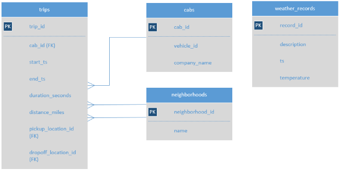

Zuber Rides Analysis
### Overview:
Zuber SQL Project: Developed and executed comprehensive SQL queries on taxi ride and weather records comprising over 10,000 records, identifying operational patterns and factors that could enhance service efficiency.

### Dataset
A database with info on taxi rides in Chicago:
* neighborhoods table: data on city neighborhoods
	• name: name of the neighborhood
	• neighborhood_id: neighborhood code
* cabs table: data on taxis
	• cab_id: vehicle code
	• vehicle_id: the vehicle's technical ID
	• company_name: the company that owns the vehicle
* trips table: data on rides
	• trip_id: ride code
	• cab_id: code of the vehicle operating the ride
	• start_ts: date and time of the beginning of the ride (time rounded to the hour)
	• end_ts: date and time of the end of the ride (time rounded to the hour)
	• duration_seconds: ride duration in seconds
	• distance_miles: ride distance in miles
	• pickup_location_id: pickup neighborhood code
	• dropoff_location_id: dropoff neighborhood code
* weather_records table: data on weather
	• record_id: weather record code
	• ts: record date and time (time rounded to the hour)
	• temperature: temperature when the record was taken
	• description: brief description of weather conditions, e.g. "light rain" or "scattered clouds"

### Visaul: Table schema

 
There wasn’t a direct connection between the tables trips and weather_records in the database, used JOIN and linked them using the time the ride started (trips.start_ts) and the time the weather record was taken (weather_records.ts). 

### Anaylsis
* Step 1. Conducted Exploratory Data Analysis (EDA)
	1. Found the number of taxi rides for each taxi company for November 15-16, 2017. Named the resulting field trips_amount and printed it along with the company_name field. Sorted the results 		by the trips_amount field in descending order. 
		
		Select cabs.company_name, COUNT(trips.trip_id) AS trips_amount
			FROM trips
    		INNER JOIN cabs ON cabs.cab_id = trips.cab_id
		WHERE CAST(start_ts AS date) BETWEEN '2017-11-15' AND '2017-11-16'
		GROUP BY company_name
		ORDER BY trips_amount DESC;

	2. Found the number of rides for every taxi company whose name contains the words "Yellow" or "Blue" for November 1-7, 2017. Named the resulting variable trips_amount, grouped the results 		by the company_name field.
		
		Select cabs.company_name, COUNT(trips.trip_id) AS trips_amount
			FROM trips
    		INNER JOIN cabs ON cabs.cab_id = trips.cab_id
		WHERE (CAST(start_ts AS date) BETWEEN '2017-11-01' AND '2017-11-07') AND (cabs.company_name LIKE '%Yellow%' OR cabs.company_name LIKE '%Blue%')
		GROUP BY company_name;

	3. In November 2017, the most popular taxi companies were Flash Cab and Taxi Affiliation Services. Found the number of rides for these two companies and named the resulting variable 			trips_amount. Join’d the rides for all other companies in the group "Other." Grouped the data by taxi company names. Named the field with taxi company names company. Sorted the result in 		descending order by trips_amount.

		Select SUBQ.company AS company, COUNT(trips.trip_id) AS trips_amount FROM (Select cab_id, CASE WHEN company_name = 'Taxi Affiliation Services' THEN 'Taxi Affiliation Services' WHEN 			company_name = 'Flash Cab' THEN 'Flash Cab' ELSE 'Other' END AS company FROM cabs) AS SUBQ INNER JOIN trips ON trips.cab_id = SUBQ.cab_id 
		WHERE (CAST(t.start_ts AS date) BETWEEN '2017-11-01' AND '2017-11-07')
		GROUP BY company
		ORDER BY trips_amount DESC;

* Step 2. Determined if and how the duration of rides from the Loop to O'Hare International Airport changes on rainy Saturdays compared to other days of the week and other weather conditions.
	1. Retrieve the identifiers of the O'Hare and Loop neighborhoods from the neighborhoods table.
		
		Select neighborhood_id, name FROM neighborhoods WHERE name = 'O''Hare' OR name ='Loop'; OR

		Select neighborhood_id, name FROM neighborhoods WHERE name LIKE '%Hare%' OR name ='Loop';

	2. For each hour, retrieved the weather condition records from the weather_records table. Using the CASE operator, broke all hours into two groups: "Bad" if the description field contains 		the words "rain" or "storm," and "Good" for others. Named the resulting field weather_conditions. The final table included two fields: date and hour (ts) and weather_conditions.
		
		Select DATE_TRUNC('hour', ts)  AS date,
		CASE WHEN description LIKE '%rain%' OR description like '%storm%' THEN 'Bad'
		ELSE 'Good' END AS weather_conditions 
		FROM weather_records;

	3.Retrieved from the trips table all the rides that started in the Loop (neighborhood_id: 50) and ended at O'Hare (neighborhood_id: 63) on a Saturday. Got the weather conditions for each 		ride. Used the method you applied in the previous task. Also retrieved the duration of each ride. Ignored rides for which data on weather conditions is not available.	
		
		Select t.start_ts AS start_ts,
		CASE WHEN wr.description LIKE '%rain%' OR wr.description like '%storm%' THEN 'Bad'
		ELSE 'Good' END AS weather_conditions,
		t.duration_seconds AS duration_seconds
		FROM weather_records wr
		INNER JOIN trips t ON wr.ts = t.start_ts
		WHERE (t.pickup_location_id = 50 AND t.dropoff_location_id = 63)
   		AND EXTRACT(isodow from t.start_ts) = 6
		ORDER BY t.trip_id;
